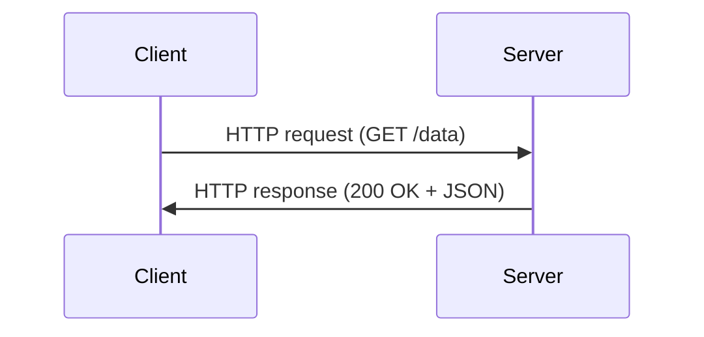

# Marp Slide Creator

A comprehensive guide for creating high-quality Marp presentations using AI.

## 1. Marp Fundamentals & Directives

For Marp configuration, file organization, global and local directives, please **read `references/marp-syntax-guide.md`**.

## 2. Slide Structure & Directives

For local slide directives (`_class`, `_paginate`, etc.), **read `references/marp-syntax-guide.md`**.

### ⚠️ List Alignment in Centered-Layout Classes

Several classes apply `text-align: center` to the entire slide section, which causes bullet lists to render centered instead of left-aligned:

**Affected classes:** `cover`, `cover-wave`, `cover-diagonal`, `cover-noir`, `cover-aurora`, `key-message`, `align-center`

**Rule:** Do not place bullet lists (`-` or `*`) or numbered lists on slides that use these classes. Lists belong on content slides with the default (left-aligned) layout.

If you must include a list on a centered-layout slide, override alignment with scoped CSS:

```markdown
<style scoped>
section ul, section ol { text-align: left; }
</style>
```

### Presenter Notes

```markdown
# Slide Content

Visible content here.

<!--
Presenter notes (only in presenter view)
-->
```

## 3. Image Syntax

For syntax on inline images, background images, and image filters, **read `references/marp-syntax-guide.md`**.

> **Export-safe rule**
> HTML scrollability is not a valid fallback for PDF/PPTX deliverables. If a code block, Mermaid diagram, table, or callout needs scrolling or clipping to stay readable, split it or redesign it.

## 4. Preview & Feedback Loop

> **⚠️ MANDATORY: Preview confirmation is required, not optional.**
> Slide creation is NOT complete until every slide has been visually verified.

### Workflow (MUST follow this order)

```
1. Edit Markdown
2. Run marp-lint.py (catches structural errors BEFORE rendering)
3. If lint issues -> fix -> repeat from step 2
4. Run marp-diagnostics.py (catches rendered-output issues)
5. If DOM issues -> fix -> repeat from step 2
6. Complete
```

### Stage 1: Pre-Render Lint (MANDATORY FIRST STEP)

**Always run the pre-render linter BEFORE marp-diagnostics.py.** It catches structural issues that the DOM extractor CANNOT detect (because the CSS never activates when the structure is wrong).

```powershell
python skills/marp-slide-creator/scripts/marp-lint.py slides/my-deck/my-deck.md
```

It detects:
- `MISSING_CLASS_DIRECTIVE`: `<div class="columns">` without matching `<!-- _class: cols-2 -->` (layout won't activate)
- `CENTERED_LIST`: Bullet lists on centered-layout slides (renders centered, not left-aligned)
- `OVERSIZED_ICON`: Catalog SVG icons used larger than 200px (icons are for small decorative use only)

> **⚠️ DO NOT skip this step.** The DOM extractor reports "no issues" even when layouts are completely broken because the content simply stacks vertically inside the slide's overflow:hidden container.

### Stage 2: Batch Diagnostic Helper

After lint passes clean, run the DOM-based diagnostics:

```powershell
python skills/marp-slide-creator/scripts/marp-diagnostics.py --theme themes/prism-edge.css slides/my-deck/my-deck.md
```

This helper exports `slides/my-deck/preview.html`, runs the DOM extractor, and writes `slides/my-deck/assets/dom-metrics.json`.

### Stage 3: DOM Metrics Extraction

If you already have a rendered HTML file, skip the export step and run the extractor directly.

**Step 1: Export HTML**
```powershell
npx -y @marp-team/marp-cli --no-stdin --allow-local-files --theme themes/azure-clarity.css slides/my-deck/my-deck.md -o slides/my-deck/preview.html
```

**Step 2: Run DOM Extractor**
```powershell
python skills/marp-slide-creator/scripts/marp-dom-extractor.py slides/my-deck/preview.html -o slides/my-deck/assets/dom-metrics.json
```

**Step 3: Analyze JSON**

Auto-detected risk flags:
- `CONTENT_OVERFLOW`: Content past slide bottom
- `DENSE_TEXT`: >600 characters
- `MANY_LINES`: >20 lines
- `IMAGE_NO_SRC`: Missing image source
- `IMAGE_BROKEN`: Failed to load

Manual checks from `elements` array:
- Element overlap
- Text truncation (`clipped: true`)
- Unbalanced layout
- Missing expected images

### Stage 3.1: Reliable Image Verification

**Never** report images as "OK" based solely on file existence or size if you cannot visually confirm them.

- **If you have Vision capabilities**: Use Stage 4 (Image-based Feedback Loop) to see the actual rendered slides.
- **If you DO NOT have Vision capabilities** (or the user opted-out):
    - Report: "Image verification skipped (Vision unavailable/opt-out)".
    - You may still report "File exists" if `marp-diagnostics.py` shows no `IMAGE_MISSING` flags, but do NOT call it "OK" or "Verified".
- **Binary Read Errors**: If `view_file` fails with a binary error when trying to view a PNG/JPG, do NOT assume the file is valid. This error simply means the file is binary.
- **`view_file` usage**: When viewing binary images, do NOT provide `StartLine` or `EndLine` arguments.

### Stage 4: AI Visual Inspection (Image-based Feedback Loop)

When you (the AI) need to visually confirm the actual layout, contrast, and element positioning, you can generate and analyze screenshots directly. This is the most reliable way to check complex layouts.

**⚠️ PERMISSION CHECK:** Before performing this stage, ensure the user has explicitly opted-in to "Visual layout checks" or "AI Vision". If not, do NOT proceed with image generation and stick to Stage 3 DOM Metrics.

**Step 1: Export to Images (PNG)**
Use Marp CLI to generate images. This will output a sequence of images (e.g., `temp-preview.001.png`, `temp-preview.002.png`).
```powershell
npx -y @marp-team/marp-cli --no-stdin --allow-local-files --theme themes/prism-edge.css slides/my-deck/my-deck.md --images png -o slides/my-deck/assets/temp-preview.png
```
> **Environment Note:** If the image export fails due to missing browser/Chromium dependencies or corporate policy restrictions, abort the visual inspection and fall back to the Stage 3 DOM Metrics Extractor.
> **Model Note:** This step requires the AI model to have image-reading (vision) capabilities.

**Step 2: Slide Identification Protocol (MANDATORY)**
To avoid misidentifying slide numbers during visual inspection:
1. **Render with Pagination**: If not already present, ensure `paginate: true` is set in the frontmatter during the diagnostic render.
2. **Cross-reference Filename & Page Number**: When viewing an image (e.g., `temp-preview.003.png`), look for the page number rendered in the footer of the slide itself.
3. **Verify Content**: Before applying a fix, confirm that the slide title or key text in the image matches the slide you intend to edit in the Markdown file.
4. **Source of Truth**: The rendered page number in the image is the source of truth for *which* slide is being seen. The file sequence (001, 002...) usually matches, but can drift if hidden slides are present.

**Step 3: Inspect the Images**
Use your file viewing tool (`view_file`) on the specific generated image(s) you need to check. This will load the image into your context, allowing you to visually identify:
- Text overflowing slide boundaries or container `div`s.
- Poor contrast (e.g., light text on a light background).
- Misaligned columns or grids.
- Improperly scaled images or icons.

**Step 4: Cleanup (MANDATORY)**

Once you have reviewed the images and made necessary corrections to the Markdown, you **MUST** delete all temporary screenshot files to keep the workspace clean.
```powershell
Remove-Item -Path "slides/my-deck/assets/temp-preview*.png" -Force
```
## 5. Content Overflow Solutions

Priority order (most design-friendly first):

### 5.1 Content Refinement
- Bulletize paragraphs
- Remove redundancy
- Stick to "1 slide = 1 message"
- Use active voice
- Move lists off centered-layout slides (`cover`, `key-message`, etc.) — lists on those slides render centered, not left-aligned

### 5.2 Per-Slide Font Size
```markdown
<style scoped>
section { font-size: 20px; }
section li { font-size: 18px; }
</style>
```

### 5.3 Global Font Size
```markdown
---
style: |
  section { font-size: 22px; }
---
```

### 5.4 CSS Utility Classes
```markdown
<div class="text-small">
Content here
</div>
```

### 5.5 Split Slides
```markdown
# Topic (1/2)
- First half

---

# Topic (2/2)
- Second half
```

### 5.6 Image Resize
```markdown


```

### 5.7 Table Overflow
```markdown
<style scoped>
section table { font-size: 16px; }
</style>
```

### 5.8 Export-Safe Code and Diagrams
- Avoid `overflow-x: auto`, clipped panes, or hidden scrollbars for content that must survive PDF/PPTX export.
- Keep code examples short enough to fit on the slide; if not, split them across slides or move the full version to notes or an appendix.
- Simplify Mermaid diagrams before shrinking them. If the diagram would need scrolling, switch to multiple slides or use `.drawio.svg`.
- Prefer readable excerpts over tiny text that only works in browser preview.

## 6. Quality Checklist

### 🚨 Critical Structure (MUST verify — these cause silent failures):
- [ ] **Every `<div class="columns">` slide has `<!-- _class: cols-2 -->` (or cols-3/split-2/split-3/split-asym/split-asym-reverse) in its directive** — without this, the layout does NOT activate and content stacks vertically
- [ ] **Every `<div class="grid">` slide has `<!-- _class: grid-quadrant -->` or `<!-- _class: grid-sharp -->` in its directive** — same reason
- [ ] **Every `<div class="profile-layout">` slide has `<!-- _class: profile -->`**
- [ ] **No bullet/numbered lists on centered-layout slides** (`cover`, `cover-wave`, `cover-diagonal`, `cover-noir`, `cover-aurora`, `key-message`, `align-center`) — lists render centered, not left-aligned
- [ ] **No catalog SVG icons used larger than width:200px** — icons are for inline/decorative use only (≤48px for cards, ≤36px for headings)
- [ ] `marp-lint.py` reports zero issues

### Structure (verify before preview):
- [ ] Column layouts use `<div class="col">` or `<div>` for each column
- [ ] Grid layouts have exactly 4 `<div class="cell">` children
- [ ] Inline classes (`badge`, `gradient-text`) use `<span>`, not `<div>`
- [ ] Alignment classes (`v-center`) applied to column divs, not `_class` directive

### Layout:
- [ ] No text overflow/cutoff
- [ ] No scroll-dependent code, Mermaid, or table regions in PDF/PPTX decks
- [ ] Images don't overlap text
- [ ] Consistent margins

### Typography:
- [ ] Clear heading hierarchy
- [ ] Readable font size (≥16px)
- [ ] Purposeful emphasis

### Visual:
- [ ] Consistent color scheme
- [ ] Good text/background contrast
- [ ] Aligned tables
- [ ] Diagrams/icons where appropriate
- [ ] **Images verified visually** (or explicitly reported as "unverified" if vision unavailable)

### Content:
- [ ] One idea per slide
- [ ] Concise bullet points
- [ ] Images serve a purpose

## 7. Visual Aids & Icons

### SVG Icons

After drafting, review for empty space. Add icons from `marp-svg-icon-placer` skill catalog.

**Always activate `marp-svg-icon-placer` skill before selecting icons.**

### Diagram Choice

Use the simplest visual that communicates the idea clearly:

1. Start with SVG icons for small accents, status markers, and lightweight labels.
2. Use Mermaid when the slide needs a sequence, flow, state, or relationship diagram that can be expressed cleanly in code.
3. Use `.drawio.svg` when Mermaid is too limited, when precise layout matters, or when the diagram needs richer shape control.
4. If drawio still cannot represent it cleanly, or the quality is not good enough, ask the user to provide a source image.

### Mermaid Diagrams

**⚠️ IMPORTANT: Do NOT use inline Mermaid code blocks in Marp slides.**

Mermaid diagrams often fail to render correctly in Marp preview and export. Instead, use Mermaid CLI to convert diagrams to SVG offline, then insert the SVG as an image.

**Workflow:**

1. Create a `.mmd` file in `slides/project-name/assets/diagrams/`:



2. Convert to SVG using Mermaid CLI:

```powershell
npx -y @mermaid-js/mermaid-cli -i slides/project-name/assets/diagrams/sequence.mmd -o slides/project-name/assets/diagrams/sequence.svg
```

3. Insert the SVG in your slide:

```markdown

```

**Good Mermaid use cases:**
- Sequence diagrams
- Flowcharts
- Simple state transitions
- Dependency or relationship diagrams

**Prefer `.drawio.svg` instead when:**
- The diagram needs precise positioning or many cross-links
- The slide must match a specific visual style
- The diagram is too dense to read comfortably in Mermaid
- You need more control over styling and layout

### Editable Diagrams

Use `.drawio.svg` format for complex diagrams (architecture, workflows).

## 8. Contrast-Aware Design

**Core Rule:** Emphasized elements and their containers must have different background colors.

### Universal Checklist

1. What is the most important element on this slide?
2. Does it have a background color?
3. What is directly behind it?
4. Are the colors similar? If yes, emphasis is lost.
5. Fix: Change layout, move element, or change color.

### Anti-Patterns

- **DO NOT** place `callout.info` inside `cols-2`/`cols-3` (same pale background)
- **DO NOT** place pale callouts on matching-tone background images
- **DO NOT** assume documented classes are visually compatible

## 9. Export & Delivery

For export commands and Quick Reference patterns (Cover Slide, Columns, Split layout), **read `references/marp-syntax-guide.md`**.
