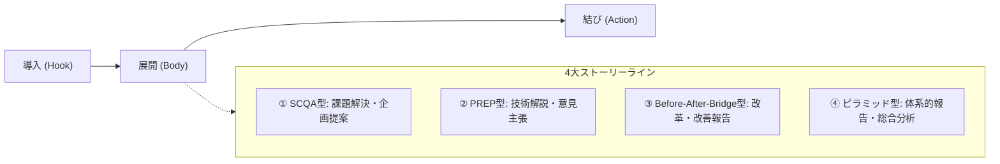

# スライド品質ガイドライン: 内容・構成・読みやすさの原則

本ガイドラインは、AIおよびスライド作成者が「伝わる・動かす・読みやすい」高品質なプレゼンテーションスライドを作成するための実践的指針です。
デザインの美しさだけでなく、**「何が言いたいのか（内容）」「どのような筋道か（構成）」「一目で理解できるか（読みやすさ）」**を徹底的に高めます。

---

## 1. 内容（Content）の品質基準: 「So What?」と具体性

### 1.1 主張型（Message-driven）タイトルの徹底
スライドのタイトルは、単なる名詞やトピック名（「〜について」「概要」「構成図」）にしてはいけません。
**「そのスライドで最も伝えたい結論・示唆（So What?）」**をタイトルやリード文で宣言します。

| ❌ 避けるべきトピックタイトル（名詞止め） | ✅ 推奨される主張型タイトル（結論・示唆） |
|---|---|
| `## システム構成` | `## マイクロサービス化によりデプロイ速度を60%短縮` |
| `## 開発の進捗状況` | `## API開発はオンスケジュール、UI結合が1週間前倒しで完了` |
| `## クラウド選定の比較` | `## コストと学習曲線の観点からAWSではなくCloudflareを採用` |
| `## 課題と対策` | `## 属人化を解消するため自動テストとCIパイプラインを必須化` |
| `## まとめ` | `## 今期は基盤刷新を完遂し、来期は新機能の高速リリースに集中` |

> **ルール**: タイトルを読んだだけで、スライドの要点が8割伝わるように記述すること。
> トピック名が必要な場合は、カテゴリバッジや小さなサブタイトルを併用する。
> 例: `<span class="badge blue">システム構成</span>` + `## Go言語導入でAPIレスポンスを80msから15msへ短縮`

---

### 1.2 抽象語の排除と定量的裏付け（Fact & Figure）
「向上した」「改善した」「適切に管理」「柔軟な対応」などの抽象語は、具体性がなく読み手に説得力を与えません。
**「どのような手段で」＋「どのような数値・事実で」**をセットで表現します。

- ❌ 抽象的: *「セキュリティを大幅に強化しました」*
- ✅ 具体的: *「全エンドポイントにOAuth2.0とmTLSを導入し、不正アクセス試行を100%遮断」*
- ❌ 抽象的: *「開発効率の向上を図る」*
- ✅ 具体的: *「共通コンポーネントライブラリを整備し、画面実装工数を平均30%削減」*

---

### 1.3 聴衆目線の価値提示（WIIFM原則）
**WIIFM（What's In It For Me? / 自分にとって何の得があるか）**:
発表者の言いたいこと（プロダクトの仕様、苦労話）だけを並べるのではなく、聴衆にとってのベネフィットや影響を前面に出します。

1. **意思決定者（マネージャー・経営層）**: コスト、リスク、ROI、スケジュールへの影響
2. **エンジニア仲間**: 技術的選定理由、アーキテクチャのトレードオフ、再利用性、運用のしやすさ
3. **ビジネス・営業**: 顧客体験の向上、競争優位性、リリース時期

---

## 2. 構成（Structure）の品質基準: 説得の論理ストーリーライン

プレゼンテーションの成否は、スライド単体ではなく「全体の論理の繋がり」で決まります。
目的やテーマに応じて、以下の4大フレームワークから最適なストーリーを選択して組み立てます。



### 2.1 4大ストーリーライン・テンプレート

#### ① SCQA型（課題解決・企画提案・プロジェクト立ち上げ）
状況を共有した上で問題を提起し、必然性を持って解決策へ導くビジネスの王道シナリオ。
1. **Situation（現状・前提）**: 誰もが合意できる客観的な事実や背景
2. **Complication（問題・複雑化）**: 変化、ボトルネック、直面した障害
3. **Question（問い・課題）**: 「では、どうすればこの課題を解決できるか？」
4. **Answer（解決策・提案）**: 当提案（プロダクト・手法）による具体的解決
5. **Impact / Action（効果と次の行動）**: 期待成果、リソース、ネクストステップ

#### ② PREP型（技術選定・アーキテクチャ提案・意見表明）
結論を冒頭と末尾に配置し、短時間で最も論理的かつクリアに伝える型。
1. **Point（結論）**: 何をすべきか、何を主張するか
2. **Reason（理由）**: なぜそう言えるのか、定性的・論理的根拠
3. **Example（事例・検証データ）**: ベンチマーク、プロトタイプ結果、具体的実例
4. **Point（再度の結論と展望）**: 結論の再確認と今後の展開

#### ③ Before-After-Bridge型（業務改善・新ツール導入・リファクタリング）
変化の落差（ギャップ）を強調して、提案の価値を際立たせる型。
1. **Before（現状のペイン）**: 従来の非効率、高コスト、ストレス
2. **After（理想の未来）**: 改善後の快適な状態、得られる圧倒的成果
3. **Bridge（架け橋・提案）**: BeforeからAfterへ到達するための具体的な手段・工程

#### ④ ピラミッド型（定例報告・網羅的レビュー・総合戦略）
主要メッセージを頂点とし、それを支える3つの柱でMECE（モレなくダブりなく）に構造化する型。
1. **Top Message**: プロジェクト全体のステータスまたは総括メッセージ
2. **Key Pillar 1**: スケジュール・マイルストーンの進捗と根拠
3. **Key Pillar 2**: 品質・テスト結果とリスク対策
4. **Key Pillar 3**: コスト・リソース状況
5. **Decisions / Next Actions**: 決裁を仰ぐ事項、今後のアクション

---

### 2.2 スライド間の接続（トランジション＆Wayfinding）
- **伏線と回収**: 前のスライドの末尾にある「課題や問い」が、次のスライドの「回答」となるように繋げる。
- **現在地の明示（Wayfinding）**:
  - 全体が10スライド以上になる場合、大セクションの切り替わりには「中扉（セクションディバイダー）」または「アジェンダ振り返り（`toc-focus`）」を挟み、聴衆の迷子を防ぐ。

---

## 3. 読みやすさ（Readability & Cognitive Load）の品質基準: 3秒ルールの実践

スライドは「読むもの」ではなく「見るもの」です。
**「表示されてから3秒以内にキーメッセージが把握できる」**情報構造を設計します。

### 3.1 箇条書き脱却（Anti-Bullet-Point）ルール
AIが最も陥りやすい罠が「単なる文章の箇条書き（Bullet Point Hell）」です。箇条書きを多用せず、以下のように構造化します。

#### パターンA: 【キーラベル＋簡潔な説明】（必須フォーマット）
箇条書きを使う場合でも、必ず太字のキーフレーズ（ラベル）を先頭に置きます。

```markdown
<!-- ❌ 悪い例: 長い文章がぶつ切りで並んでいるだけ -->
- 昨年度から導入を開始した新しいクラウド基盤ですが、運用コストが想定より高くなっています
- 監視アラートの通知設定が不十分であったため障害検知に時間がかかりました
- 今後は自動化ツールを導入して工数の削減を進めていく予定です

<!-- ✅ 良い例: キーラベル＋簡潔な説明で瞬時に理解できる -->
- **運用コストの高騰**: 想定比+35%（クラウド移行に伴うリソース過剰確保が主因）
- **障害検知の遅延**: アラート閾値の不備により初動対応に45分を要した
- **運用自動化の推進**: TerraformとAnsibleを導入し、月間40時間の運用工数を削減
```

#### パターンB: カード・2カラム対比への変換（`cols-2`, `cols-3`, `split-2`）
並列する2〜3個の重要ポイントは、箇条書きではなくカードレイアウト（`cols-2` / `cols-3`）に変換します。

#### パターンC: プロセスのステップ化（`steps` / `timeline`）
順序や手順、時系列のデータは、箇条書きではなく `steps` や `timeline` クラスを用います。

---

### 3.2 視線誘導（Zの法則 / Fの法則）とアイアンカー
人間の視線は**「左上 → 右上 → 左下 → 右下」**へと流れます。

```
[1. 主張タイトル / リード文 (結論・So What?)]  ← ここで8割理解
┌─────────────────────────┬─────────────────────────┐
│ [2. メイン視覚要素]     │ [3. 詳細・補足説明]     │
│ ・キー数値 (Big Number) │ ・根拠・背景            │
│ ・比較カード / 図解     │ ・ネクストアクション    │
└─────────────────────────┴─────────────────────────┘
```

1. **左上・上部（アンカー）**: 最重要メッセージ（主張タイトル）
2. **中央・左側**: 最も視覚的な要素（図解、大きな数字、比較カードの主役）
3. **右側・下部**: 補足説明、根拠、詳細

---

### 3.3 認知負荷低減の数値基準（Readability Thresholds）

スライドを作成・生成する際は、以下の数値を厳守してください。

| 項目 | 推奨値 / 上限値 | 理由 |
|---|---|---|
| **1スライドの主メッセージ** | **厳密に1つ**（1 Slide = 1 Message） | 複数混ざると印象が拡散する |
| **箇条書き項目数** | **最大3〜4項目**（Magic Number 3） | 5個以上は記憶に残らない（分割またはカード化） |
| **1行の文字数** | **25〜40文字以内** | 40文字を超えると視線移動で疲労する |
| **インデント階層** | **最大2階層まで** | 3階層以上のネストは構造破綻のサイン |
| **スライド内総文字数** | **200〜350文字程度** | 400文字超は「文書（Document）」でありスライドではない |

---

## 4. 品質セルフチェックシート

スライドを作成・出力する前に、以下の問いに「YES」と答えられるか確認してください。

- [ ] **タイトル**: 「〜について」ではなく、結論・主張になっているか？
- [ ] **具体性**: 「向上」「改善」などの抽象語を、数値や具体的手段で裏付けているか？
- [ ] **ストーリー**: 前のスライドの課題が、このスライドの解決策へ論理的に繋がっているか？
- [ ] **箇条書き**: 単なる文章の羅列にならず、太字のキーラベルやカード構造になっているか？
- [ ] **情報密度**: 項目数は3〜4個以内に収まり、余白（ホワイトスペース）が十分に確保されているか？
- [ ] **3秒チェック**: スライドをぱっと見た瞬間、最も重要なポイントが目に飛び込んでくるか？
