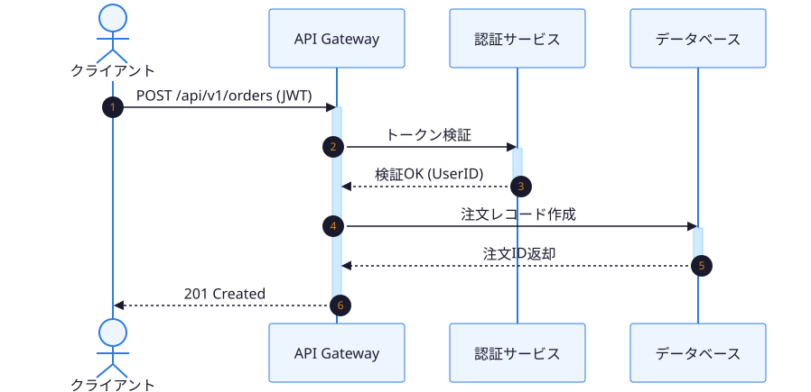
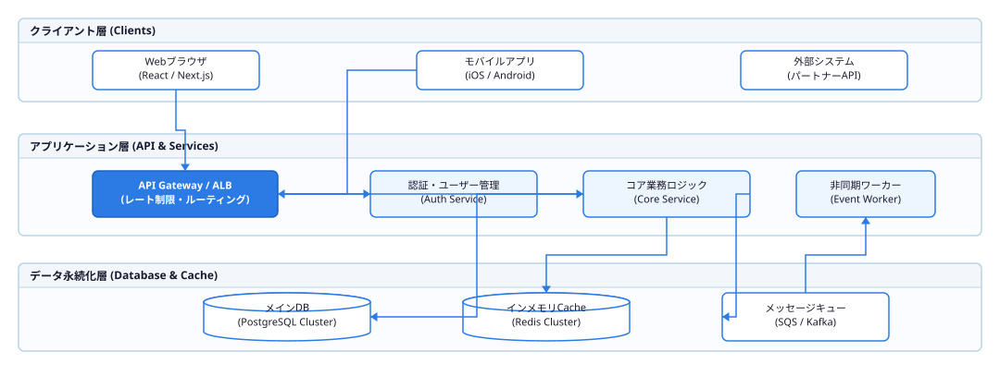
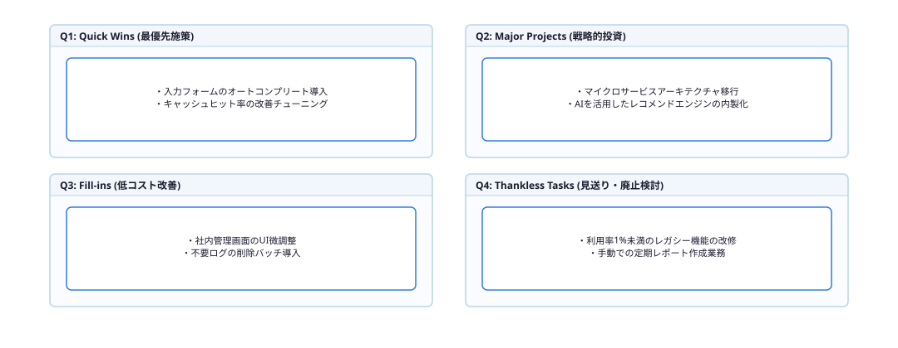

<!-- _class: cover subtitle meta -->
<!-- _paginate: false -->
<!-- _header: "" -->
<!-- _footer: "" -->

# Marp Diagram Creator

## Mermaid & draw.io 図解システム デモ

AI Agent Skills | `marp-diagram-creator` | 2026

---

<!-- _class: toc -->

# 目次

1. このデモについて
2. Mermaid — フローチャート（フルスライド）
3. Mermaid — シーケンス図（フルスライド）
4. Mermaid — 3層アーキテクチャ（フルスライド）
5. draw.io — システム構成図（フルスライド）
6. draw.io — 比較マトリクス（フルスライド）
7. 2カラム：図解 ＋ キーポイント
8. 図解生成ワークフロー
9. レイアウト別 最大幅早見表

---

<!-- _class: with-header -->

# `marp-diagram-creator` が解決する3つの課題

## スライド図解のペイン・ポイントとその答え

- **テーマ連動レンダリング**: 6テーマ（Azure Clarity, Crimson Clarity, Prism Edge, Nebula Glass, Warm Sunnyday, Slate Minimal）に対応した配色でSVGを自動生成
- **キャンバス制約バリデーション**: スライドに埋め込む前に幅・高さ・アスペクト比を自動検証
- **2エンジン対応**: Mermaid（フロー・シーケンス・状態遷移）と draw.io（複雑な構成図・マトリクス）を統一インターフェースで使用
- **Lint連携**: `marp-lint.py` の `DIAGRAM_MISSING_WIDTH` / `DIAGRAM_OVERFLOW_WIDTH` チェックが図解の埋め込みミスを事前に検出

---

# Mermaid — フローチャート

## 線形処理フロー（`flowchart-linear` テンプレート）

---

# Mermaid — シーケンス図

## API注文フロー（`sequence-api` テンプレート）

---

# Mermaid — 3層アーキテクチャ

## Web アプリケーション標準構成（`architecture-3tier` テンプレート）

---

# draw\.io — システム構成図

## 3層システムアーキテクチャ（`system-architecture` テンプレート）

---

# draw\.io — 比較マトリクス

## 優先度×コスト 施策評価マトリクス（`comparison-matrix` テンプレート）

---

<!-- _class: cols-2 -->

# 2カラム：図解 ＋ キーポイント

### 3層構成の設計メリット

- **疎結合**: 各層は独立してスケール可能
- **変更容易性**: 層をまたがずに内部実装を置換できる
- **責任分離**: 表示・業務・データが明確に分かれており保守性が高い
- **技術選定の自由度**: 各層で最適な技術スタックを選択できる

---

<!-- _class: steps -->

# 図解生成ワークフロー

1. **エンジン選定**: フロー・シーケンス → Mermaid、構成図・マトリクス → draw.io
2. **レンダリング**: `render-slide-diagram.py` でテーマ適用済みSVGを生成
3. **バリデーション**: `validate-slide-diagram.py` でキャンバス制約を自動チェック
4. **埋め込み**: Marpスライドに `` 形式で配置
5. **Lint確認**: `marp-lint.py` でDIAGRAM_OVERFLOW_WIDTHエラーがないか検証

---

<!-- _class: with-header -->

# レイアウト別 最大幅早見表

## 埋め込み時に指定すべき `width:NNNpx` の目安

| レイアウト | 該当クラス | 最大安全幅 | 推奨指定値 |
|---|---|---|---|
| フルスライド | （デフォルト） | 1120px | `width:1050px` |
| 2カラム | `cols-2` / `split-2` / `split-asym` | 520px | `width:500px` |
| 3カラム | `cols-3` / `split-3` | 360px | `width:340px` |
| 非対称（広側） | `split-asym`（左コラム） | 710px | `width:680px` |

> `marp-lint.py` が `DIAGRAM_OVERFLOW_WIDTH` エラーで上記を超えた埋め込みを検出します。

---

<!-- _class: key-message -->
<!-- _paginate: false -->

# `marp-diagram-creator` スキルで 図解作業をゼロコストに
